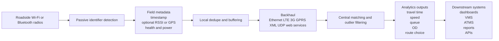

# Roadside IoT Devices That Scan Wi‑Fi or Bluetooth

## Executive Summary

The roadside market for Wi‑Fi and Bluetooth scanning devices is real, mature, and operationally important, but it is far less transparent than the camera, radar, or loop-detector markets. The clearest publicly documented purpose-built families I could verify are from entity["company","Iteris","smart mobility firm"], entity["company","SMATS Traffic Solutions","ottawa traffic data"], entity["company","Traffic Network Solutions","barcelona ITS vendor"] under the DeepBlue/trafficnow brand, entity["company","Q-Free","norway ITS vendor"], entity["company","Sensys Networks","berkeley traffic tech"], entity["company","FLIR","thermal imaging brand"], and entity["company","TPA North America","toronto BTM vendor"]. In older or more sparsely documented deployments, the main names are entity["company","Traffax","maryland BTM maker"] and its BluFAX line, entity["company","Siemens Mobility","mobility division"] with Sapphire JTM, entity["company","Post Oak Traffic Systems","texas traffic vendor"] with AWAM, and entity["company","Digiwest","bluetooth sensor vendor"] with BlueMAC. These systems are deployed on poles, sign structures, gantries, traffic cabinets, and temporary roadside furniture to estimate travel time, queueing, route choice, and origin-destination flows rather than to inspect payload contents. citeturn45search0turn34search0turn41view0turn40search0turn23search2turn46search1turn32search7turn22view1turn24search0turn27search1

A central analytical finding is that most commercial roadside products are **not** documented as packet-forensics tools. Their published materials overwhelmingly describe passive capture of Bluetooth MACs, partial MACs, Wi‑Fi MACs, or anonymous re-identification events, usually together with timestamps and sometimes RSSI, GPS, voltage, temperature, or diagnostic status. Public literature is notably thinner on BSSID/SSID fields, raw probe-request retention, and exact frame-level logging. Where those details matter, open-source packet-sniffing stacks built around entity["company","Raspberry Pi","single-board computer"] hardware, entity["company","Espressif Systems","wifi chipmaker"] ESP32 parts, and Kismet-style remote capture are the most transparent, but they are integrator-built platforms, not turnkey transportation appliances. citeturn43view0turn22view0turn41view0turn38search1turn49search6turn49search0turn49search1turn49search12

The best-documented commercial systems differ in emphasis. BlueTOAD publishes the richest legacy details about Bluetooth re-identification, partial MAC handling, power options, and integration with traffic analytics and connected-vehicle tools. SMATS is currently the most explicit about cloud/on-prem operation, remote firmware updates, REST API availability, and source-side MAC scrambling. DeepBlue publishes unusually concrete hardware specifications and central software interfaces, including Linux, microSD, web services, FTP, SSH, and TCP sockets. Q-Free’s HI-TRAC BLUE2 is one of the better documented temporary-survey class devices, with published antenna gain, microSD storage, IP68 enclosure, and multi-power options. FLIR’s TrafiCam 3 and TrafiOne are hybrid imaging sensors whose Wi‑Fi monitoring features are documented, but their radio-data-field transparency is weaker than purpose-built re-identification appliances. citeturn34search0turn43view0turn22view0turn45search0turn45search1turn37view1turn37view2turn41view2turn23search2turn23search1

Across the literature, performance depends less on the vendor brand than on sample penetration, antenna geometry, sensor placement, detection-zone size, speed, and filtering. Older field work often reported low single-digit penetration or match rates, while newer corridors and tollways can achieve much higher effective penetration because more vehicles now carry multiple radios. Even so, Bluetooth and Wi‑Fi scanners remain stronger for travel time, route choice, and queue detection than for exact counting. Academic results also show that high speeds reduce detection opportunity, and that better placement and multi-sensor configurations improve match rates materially. citeturn48view2turn47view2turn48view0turn47view0turn46search2

## Scope and source base

This report covers roadside or road-adjacent IoT devices whose published function includes passive **Wi‑Fi and/or Bluetooth scanning, MAC-address re-identification, probe-based travel time estimation, or directly related roadside analytics**. It includes purpose-built roadway appliances, hybrid traffic sensors with documented Wi‑Fi travel-time features, and open-source platform stacks used in roadside research. It excludes pure ALPR, pure radar, pure camera, DSRC/C‑V2X units with no documented passive Wi‑Fi/Bluetooth scanning, and generic enterprise access points not documented for roadway use. Primary sources were prioritized: official vendor product pages, official datasheets, agency deployment reports, and original papers. When firmware, packet schema, or API details were not available from public documentation, they are marked **unspecified**. citeturn45search0turn34search0turn41view0turn40search0turn23search2turn46search0turn47view0turn48view2

A vocabulary issue matters here. In the transportation market, “Bluetooth” and “Wi‑Fi” roadside sensors are usually sold as **travel-time**, **queue**, or **origin-destination** systems. Their published data model is usually a time-stamped identifier or anonymized identifier observed at multiple points, not a payload capture system. Several vendors explicitly describe anonymous MAC usage, partial-MAC usage, or source-side scrambling. That means a technically literate reader should treat “scan” as “passive radio re-identification” unless the documentation explicitly says otherwise. citeturn40search0turn41view0turn43view0turn45search0turn38search2

## Commercial roadside inventory

### Current or actively marketed families

| Vendor | Product family and model names | Radio bands and protocols publicly stated | Mounting, power, and comms | Data capture and processing | Firmware, OS, APIs, and updates | Key caveats |
|---|---|---|---|---|---|---|
| entity["company","SMATS Traffic Solutions","ottawa traffic data"] | TrafficXHub, TrafficBox, TrafficXHub Cabinet, iNode Pulse | Wi‑Fi and Bluetooth; SMATS also states support for “Bluetooth discoverable, low-energy” and Wi‑Fi-based detection; detection zones can be directional or 360° and up to 300 m. | Fixed roadside, portable pole mount, and in-cabinet form factors; PoE, solar, and AC power; LTE, Ethernet, and 5 GHz Wi‑Fi backhaul/management. | MAC address detection and matching for travel time, dwell/wait time, and OD; analytics in iNode; raw-data export; source-side scrambling of Bluetooth MAC addresses. | Remote configuration and firmware upgrades via web interface; cloud or on-prem hosting; documented REST API; raw-data export in multiple formats. | Public docs do **not** specify packet-level Wi‑Fi fields such as BSSID, probe frame retention, RSSI granularity, or local storage capacity. citeturn45search0turn45search1turn38search1turn38search2 |
| entity["company","Traffic Network Solutions","barcelona ITS vendor"] | DeepBlue D-model, V-model, C-model, R-model, with DeepBlue Core and Core+ software | Marketing pages describe Bluetooth, BLE, and Wi‑Fi tracking across the family; older hardware sheets explicitly list Bluetooth and optional Wi‑Fi. D-model sheet: dual-channel Bluetooth, optional Wi‑Fi, >500 m range, −104 dB receive sensitivity, side-fire geometry. | Pole, mast-arm, DIN-rail/rack, and full-cabinet variants; D-model 12–48 VDC and PoE; C-model 12–48 VDC; Ethernet, optional 3G/CDMA, dual-SIM on some models, GPS. | Travel time, queue, incident detection, and OD workflows; on-device microSD storage; central processing in DeepBlue Core/Core+ with adaptive intervals, quality diagnostics, reports, maps, heatmaps, and web services output. | Linux-based OS; ARM9 processor; remote sensor access; diagnostics and alarms; Core/Core+ support local install or clouding and publish FTP, SSH, TCP socket, web-services, and Excel export interfaces. | Vendor literature has version drift: newer pages claim BLE and, for some models, higher lane coverage than older datasheets. Packet-level Wi‑Fi fields remain unspecified. citeturn36search0turn36search1turn36search5turn36search7turn37view0turn37view1turn37view2turn37view3 |
| entity["company","Iteris","smart mobility firm"] | BlueTOAD Spectra, BlueTOAD Spectra CV, BlueTOAD CV, legacy Vantage Velocity field unit, BlueARGUS and VantageARGUS CV | Current BlueTOAD marketing states Bluetooth at 2.4 GHz plus C‑V2X at 5.9 GHz and DSRC in the CV platform. Legacy Spectra sheet lists discoverable CSR BlueCore 4 Class 1 Bluetooth plus a non-discoverable 2.4 GHz demodulator. Vantage Velocity manuals document either Bluetooth or Wi‑Fi MAC capture, but only one enabled at a time. | Ethernet/PoE or cellular/solar versions; legacy Spectra supports PoE, AC/DC options, LTE, GPS, NEMA 4X enclosures; Vantage Velocity uses 8–30 VDC, optional cellular USB modem, cabinet power, and external antenna mounting. | BlueTOAD Spectra detects both discoverable and non-discoverable paired Bluetooth and uses only a portion of the MAC for privacy. BlueARGUS publishes real-time maps, reports, XML feeds, OD, and reliability metrics. Vantage Velocity can relay immediately to host software, or store locally at least 30 days as backup. | Vantage Velocity: embedded Linux on ARM9, USB/Ethernet/serial, configurable duplicate-resend threshold, UDP output, NTP time sync, local software upgrade via GUI. Public current BlueTOAD docs mention RSU GUI, V2X Connect, and VantageARGUS CV, but low-level API details are less public than the legacy manuals. | BlueTOAD is transparent about partial-MAC privacy, but public documentation is uneven between legacy and current product generations. Published Wi‑Fi capability is clearer for legacy Vantage Velocity than for current BlueTOAD families. citeturn34search0turn44search0turn44search5turn43view0turn22view0turn33view0turn33view2turn33view4turn33view5 |
| entity["company","Q-Free","norway ITS vendor"] | HI‑TRAC BLUE2, HI‑TRAC iGATE with Bluetooth and Wi‑Fi MAC scanner modules | BLUE2 explicitly detects anonymous Bluetooth and Wi‑Fi MAC addresses; product sheet lists 9 dBi circular-polarized directional antenna and configurable detection zone; iGATE supports Bluetooth and Wi‑Fi MAC address scanner modules. | Existing signal heads, lamp columns, sign poles, and gantries; BLUE2 supports mains, external lead-acid batteries, and optional integrated solar; iGATE supports 6 V lead-acid battery plus solar and wind options; comms include 4G/3G/GPRS/Ethernet, and iGATE also uses IEEE 802.15.4 Zigbee mesh. | Journey time, toll-plaza time, OD matrices, queue warning, online traffic information; BLUE2 has 8 GB microSD capacity; iGATE acts as modular roadside gateway co-hosting other environmental and traffic sensors. | HI‑COMM 100 compatible; hosting and reporting services; UTMC support on BLUE2. Public docs do not expose a detailed API or event schema. | BLUE2 is exceptionally well documented for outdoor power and antennas, but packet-level data fields, anonymization method details, and update mechanisms are not public. Some Wi‑Fi options require mains power in certain configurations. citeturn41view0turn41view1turn41view2turn16search1 |
| entity["company","Sensys Networks","berkeley traffic tech"] | FlexID with SensID and SensTraffic software | FlexID is sold as Bluetooth re-identification for anonymous MAC collection. Public pages emphasize Bluetooth-enabled device MAC addresses; public Wi‑Fi specifics are not now prominent. | Cabinet-mounted and pole-mounted; integrates into SensTraffic/SensID workflow. | Re-identification algorithms in SensID produce congestion-management data; SensTraffic is the broader data platform. Public resources page lists current software/firmware versions for SensID, SensTraffic, Arterial Travel Time, and related tools. | Public resources show software versioning and downloadable technical resources infrastructure, but specific public API, storage, antenna, and packet-field details are unspecified. | Compared with peers, public hardware transparency is relatively light. The best evidence is functional rather than low-level. citeturn40search0turn8search0turn40search2 |
| entity["company","FLIR","thermal imaging brand"] | TrafiCam 3, TrafiOne | TrafiCam 3 explicitly states Wi‑Fi IEEE 802.11 b/g/n and that it monitors MAC addresses of Wi‑Fi-enabled devices to determine travel rates. TrafiOne lists Wi‑Fi monitoring as an optional license and Wi‑Fi IEEE 802.11 communications. | Pole-mounted hybrid sensors for intersections and urban corridors; PoE and AC/DC power; IP67; Ethernet; BPL integration; installation heights published. | These are hybrid imaging sensors first, with Wi‑Fi monitoring layered in. TrafiCam 3 publishes 8 vehicle-presence zones and count data. TrafiOne adds thermal sensing, pedestrian and bicycle detection, and ITS-IQ cloud analytics. | Web-page configuration via secure Wi‑Fi or Ethernet; FLIR ITS‑IQ cloud access. Public update method, storage model, raw identifier schema, and API details are unspecified. | Strong choice where an agency wants image-based detection plus Wi‑Fi monitoring, but much less transparent than dedicated Bluetooth/Wi‑Fi travel-time sensors about MAC handling, RSSI, or retained packet fields. citeturn23search2turn23search4turn23search1turn22view2 |
| entity["company","TPA North America","toronto BTM vendor"] | Bluetooth Traffic Monitor, BTM, TPANACollector | Public materials clearly state Bluetooth MAC collection; one presentation describes reader range around 100 m, directional and omni antenna options, and one reader covering up to 8 lanes. Current public product pages do not clearly document Wi‑Fi capture. | Temporary ground mount or pole mount, permanent cabinet or pole mount; 12–24 VDC, solar, cellular or Ethernet communications. | TPANACollector polls BTM devices, stores link and route travel times, performs outlier filtering, outputs XML, supports browser access, Google Maps, charts, VMS control through NTCIP, and can expose diagnostics including MACs, voltage, cell signal, latitude/longitude, and temperature depending on field configuration. | Server side runs on Microsoft Server 2012 Standard Edition or equivalent and MS SQL or equivalent; browser-based UI. Field-unit OS and firmware details are unspecified publicly. | Public software documentation is much richer than public sensor-hardware documentation. Travel-time clinicians know the software well, but hardware internals remain lightly published. citeturn46search0turn46search1turn46search2turn46search3 |

### Legacy or sparsely documented families still relevant in deployments and literature

| Vendor | Product family and model names | What public sources confirm | Main limitations of public record |
|---|---|---|---|
| entity["company","Digiwest","bluetooth sensor vendor"] | BlueMAC seventh-generation sensors | NCDOT reports describe 30 commercial BlueMAC units with Bluetooth, BLE, Wi‑Fi radio, GSM radio, 12 V 12 Ah battery, solar charging assembly, nighttime server uploads, and raw records containing timestamps, partial MAC addresses, and RSSI. Units were mounted on gantries, signs, and roadside posts. citeturn27search0turn27search1turn48view1 | Official vendor product pages were not readily discoverable in public search, so firmware, API, antenna, and supported protocol details beyond agency reports are unspecified. |
| entity["company","Traffax","maryland BTM maker"] | BluFAX real-time and off-line versions | Product announcements and research reports confirm Bluetooth MAC capture, paired upstream/downstream matching, removable storage for offline mode, continuous transmission for real-time mode, Debian Linux, and proprietary code scanning MACs from Bluetooth-enabled devices. Some municipal documents later describe BluFAX as collecting both discoverable Bluetooth and Wi‑Fi devices, but the original official launch descriptions emphasized Bluetooth. citeturn32search7turn20search8turn47view0turn32search3 | Public evidence on Wi‑Fi support is inconsistent across time and source type; given that ambiguity, BluFAX should be treated as definitely Bluetooth and only possibly Wi‑Fi-capable depending on generation or deployment. |
| entity["company","Siemens Mobility","mobility division"] | Sapphire JTM | Official brochure documents Bluetooth 1.0 through 4.1 compatibility, up to 100 m detection range, Ethernet or GPRS/3G backhaul, integration with Stratos, anonymous encrypted central storage, 9–30 VAC/DC input, 0.4 W at 24 VAC, and IP68 enclosure. citeturn22view1turn18search0 | Public docs do not describe Wi‑Fi, BLE, local storage, or raw data exports. It is a Bluetooth-only legacy reference point. |
| entity["company","Post Oak Traffic Systems","texas traffic vendor"] | AWAM roadside reader system | Search snippets confirm anonymous wireless address matching, MAC sensing from enabled Bluetooth devices, travel-time monitoring, and company language stating its systems use anonymous addresses from Bluetooth and Wi‑Fi. citeturn24search0turn24search1turn24search2turn24search3 | The site was unstable during retrieval, preventing verification of deeper specs. Treat AWAM as a real but sparsely documented family. |

## Open-source and research platforms

There are very few genuinely turnkey open-source roadside Bluetooth/Wi‑Fi travel-time products. Instead, the open-source ecosystem is dominated by **platform stacks** that combine commodity boards, open-source sniffing software, and custom enclosures, power systems, and antennas. Those stacks are stronger than commercial products for packet-level transparency and experimentation, but weaker for ruggedization, environmental certification, and transport-agency support. citeturn49search6turn49search0turn49search1turn35search17turn47view3

| Platform | What it is good for | Publicly evidenced radio and software capabilities | Typical roadside packaging | Publicly visible gaps |
|---|---|---|---|---|
| entity["company","Raspberry Pi","single-board computer"] 4 Model B + Kismet + Linux/Bluetooth tools | Research-grade roadside sniffer node; temporary studies; custom OD and travel-time experiments; packet-level Wi‑Fi/Bluetooth capture when paired with suitable adapters | Official Pi 4 product pages document a quad-core SBC with USB 3 and multiple RAM variants. Kismet’s official docs describe Wi‑Fi/Bluetooth/RF sniffing and remote capture split across multiple hosts. A public FOSDEM demonstration explicitly describes a roadside Raspberry Pi Bluetooth traffic-monitoring prototype. citeturn49search0turn49search8turn49search6turn49search2turn35search17 | Pole or cabinet integrator design; often PoE, AC mains, or solar plus battery HAT; Ethernet or USB cellular backhaul | Antenna performance, outdoor hardening, precise frame support, and update mechanism depend entirely on the integrator and USB radio choices rather than the base board itself. |
| OpenWrt outdoor router or CPE + Kismet remote capture | Low-cost distributed Wi‑Fi monitor nodes, especially where Ethernet/PoE outdoor radios already exist | Kismet training docs specifically call out OpenWrt routers as good remote-capture candidates. Historic OpenWrt Kismet drone configuration files and package metadata confirm monitor-mode and kismet-drone support in embedded deployments. citeturn35search0turn49search16turn49search13 | Outdoor radio/CPE on pole or cabinet; typically PoE with Ethernet backhaul | Strongly chipset- and driver-dependent. Bluetooth generally requires an added USB radio. Packet fields available in practice vary with hardware support. |
| entity["company","Espressif Systems","wifi chipmaker"] ESP32 and ESP32‑S3 development modules | Ultra-low-cost custom roadside probes, lightweight BLE/Wi‑Fi scanners, and experimental CSI/RSSI or edge-analytics nodes | Official Espressif pages and datasheets show integrated 2.4 GHz Wi‑Fi with Bluetooth or Bluetooth LE; ESP32‑S3 adds BLE 5 long-range and 2 Mbps PHY options. Recent academic work continues to use ESP32-class devices for traffic monitoring and signal automation experiments. citeturn49search1turn49search5turn49search12turn49search18turn35search7 | Compact battery and solar builds, roadside boxes, or smart-pole enclosures | Not a turnkey transportation stack. Storage, APIs, OTA update path, packet retention, and analytics pipeline are all custom and therefore unspecified unless a project publishes them. |

A practical implication follows from that table. If the requirement is **packet-level visibility** into Wi‑Fi management traffic, flexible logging, or academic reproducibility, open-source stacks are better. If the requirement is **agency-grade roadside operation**, environmental durability, centralized analytics, and VMS or ITS workflow integration, commercial appliances remain much easier to deploy and maintain. citeturn49search6turn45search1turn37view2turn46search0

## Capture and processing architecture

The commercial systems studied here follow a surprisingly consistent architecture. Devices are mounted at fixed roadside points and passively listen for Bluetooth or Wi‑Fi radio identifiers from passing vehicles, phones, wearables, navigation systems, or pedestrian devices. The field unit then attaches a timestamp and sometimes other metadata such as RSSI, GPS position, temperature, voltage, cell-signal strength, or health state. Data either stays locally until collection, is sent in near real time to a host, or both. Central software then deduplicates repeated reads, matches re-identifications across sensor points, runs outlier filters, and emits travel times, route times, speeds, queue alarms, OD matrices, dashboards, XML, REST, or sign-control outputs. citeturn33view4turn46search0turn37view2turn45search1turn41view0turn48view1

The best public evidence for **on-device storage and edge buffering** comes from BlueTOAD/Vantage Velocity, DeepBlue, and Q‑Free. Vantage Velocity can store data locally as backup and typically keep at least 30 days of files, while still forwarding reads to host software when connectivity exists. DeepBlue publishes microSD storage across multiple hardware families, and Q‑Free publishes 8 GB microSD on HI‑TRAC BLUE2. FLIR and SMATS do not disclose comparable storage details publicly, though both do disclose cloud or central-platform workflows. citeturn33view0turn33view4turn37view0turn37view1turn42view0turn45search1turn23search2

The best public evidence for **interfaces and integrations** is also uneven. SMATS publishes a documented REST API, raw exports, cloud or on-prem hosting, and remote sensor management. DeepBlue Core publishes web services plus FTP, SSH, and TCP sockets. TPA publishes XML output and NTCIP sign integration. Iteris publishes XML in legacy BlueARGUS materials and connected-vehicle integration with VantageARGUS CV and V2X Connect in current materials. Q‑Free documents UTMC support and HI‑COMM compatibility. Sensys and FLIR publicly document ecosystem integration, but their public low-level interfaces are less explicit. citeturn45search1turn37view2turn37view3turn46search0turn43view0turn44search0turn41view2turn8search0turn23search2

The public record on **anonymization and pseudonymization** is stronger than the public record on packet capture. BlueTOAD Spectra explicitly says it uses only part of the device MAC address for non-discoverable reads. SMATS says it scrambles Bluetooth MAC addresses at the source. Sensys markets FlexID around anonymous MAC collection. Q‑Free repeatedly describes anonymous Bluetooth/Wi‑Fi detection. These statements materially matter: they show vendors are designing for movement analytics, not for a packet-inspection or forensic use case. At the same time, movement re-identification is still movement re-identification; even when names and payloads are absent, repeated identifier observations remain behaviorally sensitive. citeturn43view0turn45search0turn40search0turn41view0

One recurring transparency gap deserves emphasis. Commercial roadside documentation usually says **“Bluetooth MAC addresses,” “Wi‑Fi MAC addresses,” or “anonymous data”** and rarely goes further. Explicit public statements about BSSID retention, SSID retention, or raw probe-request archival are uncommon. By contrast, Kismet’s official positioning as a Wi‑Fi/Bluetooth sniffer with remote capture implies packet-level collection on supported radios, which is why open-source stacks dominate research requiring richer 802.11 fields. In other words, if the question is “can this roadside system scan Wi‑Fi or Bluetooth,” many commercial devices qualify; if the question is “can it publicly, demonstrably archive raw Wi‑Fi management frames with full field visibility,” the answer is usually **unspecified or no public evidence**. citeturn49search6turn43view0turn41view0turn45search0

## Findings from academic and industry deployments

The academic and agency literature is much more candid than vendor brochures about what makes roadside Wi‑Fi/Bluetooth sensing work or fail. Three variables show up repeatedly: **sample penetration**, **sensor geometry**, and **data cleaning**. Older Bluetooth deployments were often constrained by low penetration, especially when not all vehicles carried enabled devices. Newer deployments report better coverage because vehicles and occupants now often carry multiple radios, but the literature still treats filtering and configuration as decisive. citeturn48view2turn47view2turn47view0turn48view0

| Study or deployment | Platform and setting | Methodology | Main finding | Privacy and ethical summary |
|---|---|---|---|---|
| entity["organization","University of Maryland","college park research"] with the entity["organization","Maryland State Highway Administration","maryland highway agency"] permanent BTM work | BluFAX on the Maryland highway network | Built permanent Bluetooth sensors, produced specs, software, system architecture, and validation against other data sources including toll tags. | The project concluded that BTM could deliver 24/7/365 direct travel-time measurement at high accuracy and support travel time, delay, and OD use cases; the report also formalized permanent installation architecture and software workflow. citeturn47view0 | The work treated Bluetooth identifiers as anonymous probes for performance management rather than identity records, but still relied on repeated matching across locations. |
| entity["organization","Washington State Department of Transportation","washington state DOT"] error-modeling work | Custom MACAD Bluetooth system | Compared Bluetooth travel-time measurements with license-plate-reader ground truth while varying antenna types and sensor arrangements. | A combination of sensors improved match rates, and the study found Bluetooth travel times generally accurate enough for most applications, but slightly biased upward because slower vehicles are more likely to be detected. citeturn48view2 | The study explicitly framed Bluetooth as a low-cost re-identification technology with characteristic error sources rather than a perfect ground truth. |
| Bangkok toll-road evaluation | Bluetooth detectors plus microwave radar | Processed 19.4 million records from 11 detector stations, used five cleaning steps, and compared Bluetooth penetration to radar counts at 15-minute intervals. | Daytime penetration was reported at 50–90 percent, nighttime 20–50 percent; speeds above 80 km/h reduced MAC detections; the authors recommended at least 1 percent penetration in peak and 5 percent off-peak for reliable estimation in that context. citeturn47view2 | The workflow focused on transactional Bluetooth data and filtering rather than identity resolution beyond trip reconstruction. |
| Multimodal passive Wi‑Fi/Bluetooth speed estimation | Passive Wi‑Fi and Bluetooth urban sensing | Used MAC capture plus RSSI correction and semi-supervised clustering to infer walk, bike, and car speeds from passive roadside sensors. | The reported overall speed-estimation accuracy was about 85 percent, and the paper explicitly used RSSI to correct bias introduced by sensor detection range. citeturn48view0 | This work is especially important ethically because it extends roadside radio sensing beyond vehicles to cyclists and pedestrians. |
| entity["organization","North Carolina Department of Transportation","north carolina DOT"] I‑85 integrated corridor management evaluation | BlueMAC seventh-generation roadside sensors | Deployed 30 commercial sensors on gantries, signs, and roadside posts; used different outlier methods for freeway and arterial routes; estimated diversion rates under incidents. | Bluetooth sensing was operationally valuable not only for travel time and OD but also for diversion-rate estimation; the project reported defensible diversion estimates by incident severity. citeturn27search1turn48view1 | The report used partial MAC addresses and RSSI in raw data, again showing a movement-analytics rather than payload-inspection architecture. |
| Calgary comparison of Bluetooth sensors and crowdsourcing | BluFAX sensors along goods-movement corridors | Compared Bluetooth-based travel-time reliability metrics with TomTom-style crowdsourced traffic data. | The authors concluded that Bluetooth sensors can provide useful travel-time and speed measures, but the technology must be understood as a sampled data source rather than a full census. citeturn20search5 | The paper described MAC-based travel-reliability measurement without personal profiling claims, but the underlying technique still depends on persistent identifiers over a segment. |
| Low-cost open-hardware Wi‑Fi RSSI system | Open-source hardware for traffic monitoring | Used Wi‑Fi RSSI disturbance rather than MAC matching to detect vehicles with hardware costing under $50. | The system could detect some vehicle classes and offered a low-cost, privacy-preserving alternative for wider coverage, but it was still an early-stage, one-vehicle-at-a-time method. citeturn47view3 | This is the clearest example of a privacy-minimizing design that avoids the commercial re-identification model entirely by relying on signal-strength perturbation. |

A notable industry lesson from TPA’s Canadian deployments is that roadside Bluetooth sensing scales beyond academic pilots when it is tightly integrated with operations. Public TPA materials describe temporary and permanent deployments, cabinet integration, solar operation, cellular or Ethernet backhaul, XML data feeds, NTCIP sign interfaces, and minute-by-minute delay messaging on Highway 401. That is a good illustration of where these devices sit in practice: as sensors inside a broader ATMS or work-zone information loop. citeturn46search2turn46search3

A second industry lesson is that vendors increasingly sell these systems as **multimodal**. Q‑Free, FLIR, SMATS, and DeepBlue all frame their products as useful for pedestrians, bicycles, ports, work zones, or mixed urban settings, not only freeway travel time. That expansion increases analytical power, but it also widens the ethical footprint of the technology because more non-driver movement becomes measurable. citeturn41view0turn23search2turn45search0turn36search0

## Limitations, accuracy, and ethical takeaways

The most important technical limitation is that passive Bluetooth/Wi‑Fi roadside sensing is a **sample-based re-identification method**, not a census count. The sample size changes with device ownership, device settings, radio randomization, paired versus discoverable state, shielding by the vehicle body, antenna directionality, and traffic speed. That is why commercial systems emphasize travel time, delay, and OD, while operational presentations often warn that they are not exact count or occupancy sensors. citeturn46search2turn48view2turn47view2

The second limitation is **detection-zone bias**. Larger or less selective zones can improve matches, but they can also pick up cross-street or non-target traffic. Smaller or more selective zones can reduce contamination, but may lower match rates. The WSDOT work explicitly explored this tradeoff through multiple antenna and arrangement tests, and the multimodal Wi‑Fi/Bluetooth literature now treats RSSI correction as a key part of coping with range bias. citeturn48view2turn48view0

The third limitation is **public-document opacity**. Some of the current best-known products publish little about raw event schema, antenna beam shape, sampling cadence, BLE support, deduplication logic, or update mechanisms. In several families, different vintages of literature disagree. DeepBlue is an example: newer marketing pages broaden the family to BLE and higher lane counts, while older datasheets are more conservative. Similarly, BlueTOAD’s current marketing highlights the CV stack, while its older Spectra and Velocity documentation is much richer technically. That makes public-source due diligence possible, but only to a point. citeturn36search5turn37view1turn34search0turn22view0

The ethical takeaway is subtle. Many vendors have adopted privacy-aware design choices such as partial MACs, scrambled MACs, or anonymous identifiers, and several academic papers explicitly seek privacy-preserving alternatives. That is meaningful. But even anonymized or pseudonymized roadside radio observations can still reveal routes, dwell behavior, and recurring movement patterns if linked over time and space. The ethical question is therefore not only whether a system stores names or payloads, but also whether it minimizes retention, limits visibility, and constrains the granularity of longitudinal tracking. citeturn43view0turn45search0turn40search0turn47view3

### Capability chart

| Device class | Turnkey roadside ruggedization | Wi‑Fi scanning documented | Bluetooth scanning documented | Packet-level transparency in public docs | Public API or export clarity | Public privacy feature clarity |
|---|---|---:|---:|---:|---:|---:|
| BlueTOAD and legacy Vantage Velocity | High | Medium | High | Medium | Medium | High |
| SMATS TrafficXHub family | High | High | High | Low | High | High |
| DeepBlue family | High | Medium to High | High | Medium | High | Medium |
| Q‑Free HI‑TRAC BLUE2 and iGATE | High | High | High | Medium | Medium | Medium |
| Sensys FlexID and SensID | High | Low in current public docs | High | Low | Low | High |
| FLIR TrafiCam 3 and TrafiOne | High | High | Low | Low | Low to Medium | Low |
| TPA BTM and TPANACollector | Medium to High | Low | High | Medium | High | Medium |
| BluFAX, Sapphire JTM, AWAM, BlueMAC | Medium | Varies | High | Medium to Low | Medium to Low | Medium |
| Open-source Raspberry Pi, OpenWrt, ESP32 stacks | Low to Medium | High | High | High | High if integrator exposes it | Integrator-defined |

The chart above synthesizes the vendor and study record rather than claiming a common test benchmark. It should be read as a documentation-transparency matrix, not as a laboratory ranking. citeturn34search0turn22view0turn45search0turn45search1turn37view2turn41view2turn40search0turn23search2turn46search0turn32search7turn49search6

The bottom line is straightforward. If the goal is to understand **which roadside IoT systems can scan Wi‑Fi or Bluetooth**, the answer is that a substantial set of transportation-focused products can, but they mostly do so as **passive identifier re-identification appliances** rather than as openly documented packet sniffers. If the goal is to procure a fielded, agency-grade system, the strongest publicly documented families are BlueTOAD, SMATS TrafficXHub, DeepBlue, and Q‑Free HI‑TRAC BLUE2, with Sensys, FLIR, and TPA filling important specialized niches. If the goal is packet-level experimentation, richer 802.11/BLE observability, or method development, open-source Raspberry Pi, OpenWrt, and ESP32 stacks are more flexible, but they are not substitutes for certified roadside transportation products. citeturn34search0turn45search0turn37view1turn41view0turn40search0turn23search2turn46search0turn49search6turn49search1