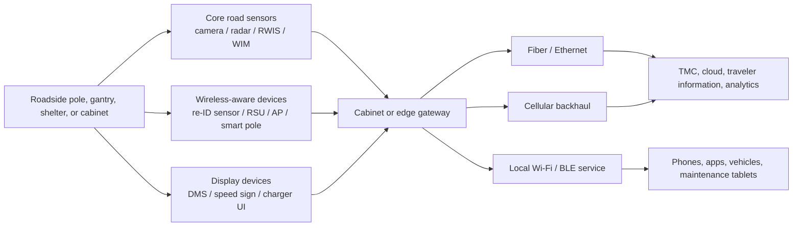
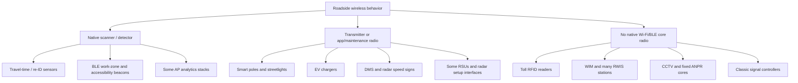

# Roadside IoT Devices With Wi‑Fi or Bluetooth Capabilities Along Minnesota and US Roads

## Executive summary

This report inventories the full set of major roadside and curbside IoT device categories that are commonly deployed along highways and roads in the United States, with special attention to documented deployments and architecture in Minnesota. The main conclusion is that **true roadside Wi‑Fi/Bluetooth scanning is concentrated in a relatively small subset of field devices**: Bluetooth/Wi‑Fi re‑identification sensors used for travel time and origin-destination work, some connected-vehicle roadside units that add local Wi‑Fi/Bluetooth service radios, public/outdoor access points, certain smart-pole and smart-streetlight platforms, some parking and EV-charging systems, BLE-based work-zone/accessibility beacons, and a subset of radar speed signs or portable work-zone equipment with local Bluetooth/Wi‑Fi communications. citeturn14search0turn23search1turn27search4turn36search11turn32search11turn38search8

By contrast, **most traditional roadside ITS hardware is not a Wi‑Fi/Bluetooth scanner by default**. Traffic signal controllers, toll readers, ANPR cameras, fixed CCTV cameras, weigh-in-motion systems, many RWIS stations, and most radar/LiDAR traffic sensors primarily use Ethernet, fiber, serial, cellular, DSRC/C‑V2X, RFID, or proprietary short-range radios. In those categories, Wi‑Fi or Bluetooth usually appears only as a maintenance/configuration interface, an optional outdoor access point, or an external industrial router added inside a cabinet. citeturn15search4turn17search2turn20search5turn21search1turn37search6turn9search1turn22search3turn29search16

For entity["organization","Minnesota Department of Transportation","state DOT, minnesota, us"] specifically, the documented roadside estate includes E‑ZPass/MnPASS toll readers, DMS, CCTV, RWIS, WIM, cabinet-based Ethernet infrastructure, intelligent work-zone systems, connected-corridor/RSU readiness, and corridor EV-charging investments. Minnesota-sponsored research and pilots also document Bluetooth-based work-zone and pedestrian accessibility systems, plus Bluetooth-based travel-time sensing research. citeturn7search0turn15search19turn9search1turn37search12turn30search9turn28search2turn25search0turn32search1turn30search0

No public source provides a single statewide or national census of every installed roadside SKU. The most defensible approach is therefore a **category-complete inventory**: every major roadside equipment type is included below, along with documented representative manufacturers/models, radio capability, mounting/interface patterns, deployment evidence, and retrofit paths. That is the structure used in this report. citeturn15search19turn29search2turn30search5

## Scope and method

I treated a “roadside IoT device” as any field device deployed on a pole, mast arm, gantry, cabinet, trailer, shelter, curbside post, or similar right-of-way infrastructure that senses, processes, displays, or communicates transportation or curbside information. I then classified radio behavior into four analytical buckets:

- **Transmit Wi‑Fi/Bluetooth**: the device advertises or serves Wi‑Fi/BLE, or uses those radios for commissioning, maintenance, or app integration.
- **Scan/detect Wi‑Fi/Bluetooth passively**: the device observes nearby Wi‑Fi/Bluetooth traffic or device identifiers to infer presence, travel time, or origin-destination patterns.
- **Scan/detect actively**: the device initiates or manages discovery/association procedures, usually as an access point or app-linked BLE endpoint.
- **No native Wi‑Fi/Bluetooth**: the device uses other communications layers unless an add-on module/router is installed.

This framework aligns with how manufacturer documents distinguish travel-time sensors, RSUs, outdoor APs, chargers, and smart poles from conventional cabinet, toll, CCTV, WIM, and signal-control hardware. It also matches the way the entity["organization","Federal Highway Administration","us transport agency"] and MnDOT describe field ITS architectures built around cabinets, Ethernet, fiber, and specific roadside subsystems. citeturn14search0turn23search1turn27search4turn29search2turn15search4turn30search5

## Capability matrix

| Category | Representative vendor/model families | Wi‑Fi / Bluetooth capability | Typical mounting and interfaces | Deployment examples and retrofit notes |
|---|---|---|---|---|
| Bluetooth/Wi‑Fi travel-time and re-identification sensors | entity["company","Iteris","transportation technology company"] BlueTOAD Spectra CV; entity["company","Sensys Networks","traffic detection company"] FlexID | **Transmit:** sometimes Bluetooth or local service radio on hybrid units. **Scan/detect:** **yes**; this is the core category for passive Bluetooth/Wi‑Fi/BLE re-identification. | Pole, mast arm, or cabinet. Typical interfaces are PoE/Ethernet, cellular, and in some deployments solar power. | BlueTOAD explicitly combines C‑V2X with historical and real-time Bluetooth detection; FlexID is a cabinet/pole-mounted re-identification product for anonymous Bluetooth-based matching. Minnesota research also evaluated Bluetooth-based travel-time/work-zone sensing. Retrofitability is high because these units are standalone add-ons rather than embedded signal hardware. citeturn14search0turn23search1turn30search0 |
| V2X roadside units | entity["company","Kapsch TrafficCom","mobility technology company"] RIS-9360 / RIS-9260; entity["company","Yunex Traffic","traffic systems company"] RSU families | **Transmit:** **yes** for DSRC/C‑V2X; on some products also local 2.4 GHz Wi‑Fi/Bluetooth hotspot. **Scan/detect:** usually not roadway Wi‑Fi/BLE scanning, but some units support local smart-device service radios. | Pole, signal pole, cabinet-adjacent enclosure, or mast arm. Common interfaces are PoE, dual Ethernet, GPS, LTE backhaul, and cabinet controller connections. | MnDOT connected-corridor/SPaT documents describe roadside DSRC RSU deployment and the need for cabinet space and communications. Kapsch and Yunex/Siemens-family datasheets show Wi‑Fi/Bluetooth hotspot capability on certain RSU platforms. Retrofitability is moderate to high if cabinet power, Ethernet, and mounting exist. citeturn28search0turn28search18turn36search11turn28search2turn28search6 |
| Smart streetlights and smart poles | entity["company","Signify","lighting company"] BrightSites; entity["company","Ubicquia","smart infrastructure company"] UbiCell / UbiHub | **Transmit:** often **yes** for Wi‑Fi, and on some platforms BLE/beaconing. **Scan/detect:** sometimes via attached AP/video/IoT modules, but not usually passive traffic MAC re-ID by default. | NEMA photocell socket, integrated pole modules, or pole-attached smart node. Uses luminaire power with fiber, Ethernet, wireless backhaul, or cellular. | BrightSites smart poles are documented with integrated Wi‑Fi and camera options; Ubicquia states its communication modules include mesh Wi‑Fi, Bluetooth, and Bluetooth beaconing. US deployments are documented in entity["city","Mesa","Arizona, US"] and through the entity["organization","New York Power Authority","NY state authority, us"] smart-streetlight program. Retrofitability is very high because many products replace the photocell or add a compact pole node. citeturn12search11turn36search6turn10search2turn36search2turn11search2turn11search0 |
| Public Wi‑Fi hotspots and outdoor APs | entity["company","Cisco","networking company"] Catalyst 9163E / 9179F and Meraki outdoor APs | **Transmit:** **yes**; this category is native Wi‑Fi. Many outdoor APs also include BLE/IoT radios or integrated beacons. **Scan/detect:** **yes**, as part of AP management/scanning and BLE beacon ecosystems. | Light poles, façades, shelters, stadium poles, or street furniture. Common interfaces are PoE/DC, Ethernet, fiber, and wireless backhaul. | Cisco’s outdoor AP line documents Wi‑Fi 6/6E/7 service and BLE/IoT radios, while Meraki documentation states integrated BLE beacon technology in outdoor APs. These are often deployed in downtown corridor and smart-streetlight projects such as Mesa/BrightSites. Retrofitability is high wherever power and backhaul exist. citeturn27search4turn27search0turn27search1turn27search9turn11search2 |
| Cellular small cells on poles | entity["company","Ericsson","telecom company"] Street Radio 4402 / Streetmacro 6705; entity["company","Nokia","telecom company"] small-cell radios | **Transmit:** cellular only by default, **not** Wi‑Fi/BLE. **Scan/detect:** no native Wi‑Fi/BLE. | Streetlights and utility poles with fiber/power or pole-integrated backhaul. | Ericsson positions Street Radio and Streetmacro products as streetlight-mounted small-cell infrastructure. In smart-pole ecosystems, Wi‑Fi may be co-hosted, but that functionality is usually in a separate AP or smart-pole payload rather than the small cell itself. Retrofitability depends on the hosting pole ecosystem more than on the radio head. citeturn27search2turn27search6turn27search3turn11search12 |
| Traffic signals, controllers, and standard signal cabinets | entity["company","Econolite","traffic control company"] Cobalt / 2070 controller families | **Transmit:** usually **no** native Wi‑Fi/BLE. **Scan/detect:** **no** by default. | NEMA or 332/336 cabinet, pole/mast-arm field wiring, MMU/MMU+, Ethernet switches, fiber, serial/EIA-485, and controller I/O. | MnDOT design documents emphasize cabinet Ethernet infrastructure and note space/communications needs for SPaT/RSU additions. Econolite’s connected-vehicle co-processor supports DSRC device connections, but Wi‑Fi/BLE normally enters through attached RSUs, APs, or routers. Retrofitability is high because cabinets are the most common integration point for added radios. citeturn13search6turn13search8turn13search9turn15search0turn15search4 |
| Variable / dynamic message signs | entity["company","Daktronics","digital display company"] Vanguard travel-time/toll-rate DMS; entity["company","Wanco","traffic equipment company"] portable and trailer signs | **Transmit:** some products include local Wi‑Fi access points or browser-based remote control. **Scan/detect:** generally **no** Wi‑Fi/BLE traffic detection. | Overhead gantry, roadside post, or trailer. Power can be AC mains or solar/battery; communications are Ethernet, cellular, or local Wi‑Fi/AP. | Daktronics’ travel-time/toll-rate DMS documents a maintenance Wi‑Fi access point; Wanco signs document web-based control and remote fleet management. MnDOT treats DMS as a statewide ITS asset class. Retrofitability is high because communications usually reside in the sign controller or adjacent cabinet. citeturn16search5turn16search4turn15search10turn15search19 |
| Tolling gantries and HOT/MnPASS toll readers | entity["company","TransCore","rfid tolling company"] Encompass reader family | **Transmit:** not Wi‑Fi/BLE; uses 915 MHz RFID/ETC or other tolling radios. **Scan/detect:** **no** Wi‑Fi/BLE by default. | Overhead gantry or roadside toll beacon/read zone with lane controllers, loops, fiber/Ethernet, and power. | MnDOT’s E‑ZPass page states that overhead antennas and readers detect windshield tags. TransCore reader docs describe 915 MHz RFID operation. This category is often mistaken for “wireless scanning,” but it is typically RFID/DSRC-style tolling rather than Wi‑Fi/BLE. Retrofitability to Wi‑Fi/BLE requires separate equipment. citeturn7search0turn17search2turn17search0turn15search19 |
| Traffic CCTV cameras | entity["company","Axis Communications","network camera company"] Q1786-LE class and similar PTZ/zoom IP cameras | **Transmit:** generally IP video over wired network, not Wi‑Fi/BLE by default. **Scan/detect:** **no** Wi‑Fi/BLE traffic sensing. | Pole, mast-arm extension, bridge, or building. Usually PoE/Ethernet/fiber. | MnDOT video system documents refer to Ethernet/fiber camera communications, and current plan sheets show Ethernet from cabinet to camera attachment. Retrofitability is moderate, but typically through external wireless bridges or cabinet routers rather than inside the camera. citeturn21search1turn15search6turn15search7 |
| Radar / LiDAR / fusion traffic sensors | RTMS Echo; Heimdall radar family; LiDAR products with IP backhaul | **Transmit:** usually **no** Wi‑Fi/BLE for operational sensing; some radar families offer optional Bluetooth for local setup. **Scan/detect:** generally **no** Wi‑Fi/BLE traffic scanning. | Side-fire roadside pole, overhead mast arm, or tunnel/bridge mount. Interfaces are usually PoE/DC, Ethernet, serial, and optional camera/GPS. | RTMS Echo is a highway sensor with browser-based remote access; Heimdall datasheets explicitly allow a Bluetooth option for ground-level maintenance. This category is usually about radar/video/lidar physics, not wireless device re-identification. Retrofitability is moderate and usually maintenance-oriented. citeturn22search1turn22search3 |
| RWIS / environmental sensor stations | entity["company","Campbell Scientific","environmental instrumentation company"] Aspen 10-enabled field devices; entity["company","Vaisala","weather instrumentation company"] road-weather stations and sensors | **Transmit:** traditional ESS often **no** Wi‑Fi/BLE; newer IoT edge devices may provide Bluetooth/NFC and sometimes Wi‑Fi-class local connectivity. **Scan/detect:** no roadway Wi‑Fi/BLE scanning. | Tower/pole, cabinet, or bridge with atmospheric and pavement sensors. Interfaces include serial, SDI‑12, Ethernet, cellular, solar/line power. | MnDOT’s RWIS ConOps describes ESSs with shared power/communications for other subsystems. Campbell Scientific’s Aspen 10 ecosystem documents Bluetooth/NFC field connection through CampbellGo. Retrofitability is high through add-on edge gateways and cabinet routers. citeturn9search1turn9search3turn8search12turn8search6turn8search10 |
| Parking meters, curbside devices, and parking occupancy sensors | entity["company","IPS Group","parking technology company"] M5 and related meter ecosystem; entity["company","Flowbird","parking mobility company"] curbside/app ecosystem; FlexRadar parking detection | **Transmit:** often **yes** for BLE/app interaction and other wireless meter links. **Scan/detect:** parking occupancy is normally magnetic/radar, not Wi‑Fi/BLE traffic scanning; some patents and meter ecosystems include nearby wireless interactions. | Curbside meter posts, in-pavement sensors, kiosks, or pay stations. Power is often solar/low-voltage; comms are cellular, RF mesh, Ethernet, BLE, or app links. | IPS documents Bluetooth-enabled app integration and a wireless smart-meter ecosystem; Flowbird documents Bluetooth/QR capabilities; Sensys FlexRadar provides parking occupancy sensing. Retrofitability is high because meters, apps, and sensors are modular. citeturn23search0turn23search4turn23search6turn23search11turn23search13turn24search0turn24search2 |
| EV chargers in roadside and corridor locations | entity["company","ABB","electrification company"] Terra families; entity["company","ChargePoint","ev charging company"] Express Plus / commercial charger families | **Transmit:** **yes** on many products for Wi‑Fi, Bluetooth, cellular, OCPP networking, and app/installer functions. **Scan/detect:** BLE is frequently used for installer commissioning, not passive traffic-device scanning. | Pedestal, wall, or gantry/service-plaza installation; AC or DC power, Ethernet, 4G/5G, Wi‑Fi, BLE, OCPP. | ABB documents Ethernet/Wi‑Fi/Bluetooth/4G options; ChargePoint documents Bluetooth-enabled installer workflows and Cellular/WiFi-equipped Express Plus configurations. MnDOT is administering NEVI and related statewide EV-charging programs. Retrofitability is high because networking modules are integral or field-addable. citeturn25search7turn25search11turn26search7turn26search5turn25search0turn25search4turn25search8 |
| Law-enforcement / ANPR cameras | entity["company","Motorola Solutions","public safety technology company"] fixed LPR systems; entity["company","Flock Safety","public safety technology company"] roadside LPR cameras | **Transmit:** usually LTE or wired Ethernet, not Wi‑Fi/BLE by default. **Scan/detect:** not Wi‑Fi/BLE traffic scanning; the scan target is plates/vehicles. | Pole, roadside mast, solar pole, trailer, or over-roadway mounting. | Motorola documents fixed LPR camera deployments and high-speed fixed roadside capture; Flock says its LPR cameras are solar-powered and LTE-connected and do not rely on Wi‑Fi. Retrofitability to local Wi‑Fi/BLE typically requires an external gateway/router. citeturn20search4turn20search11turn20search2turn20search5 |
| Construction-zone equipment and smart work zones | Wanco queue-warning systems; entity["company","Ver-Mac","traffic equipment company"] queue-warning/JamLogic; BLE WorkzoneAlert beacons | **Transmit:** yes on BLE beacon and cellular-linked portable systems. **Scan/detect:** depends on configuration; some systems use Bluetooth/Wi‑Fi travel-time sensing, others use radar/video/traffic sensors only. | Portable message-sign trailers, work-zone barrels, light posts, speed signs, and temporary cabinets. | MnDOT documented intelligent work-zone signs on I‑94, while Minnesota/University of Minnesota research documented BLE beacons attached to work-zone infrastructure and Bluetooth-based work-zone travel-time sensing. Retrofitability is very high because these are intentionally modular, portable platforms. citeturn30search2turn30search7turn30search9turn32search11turn32search12turn32search19 |
| Pedestrian / bicycle counters and accessibility beacons | SensBike-style bike counting; MnDOT/University of Minnesota BLE accessibility systems | **Transmit:** BLE accessibility beacons **yes**; mainstream bike/ped counters often no. **Scan/detect:** some research systems use Wi‑Fi/Bluetooth as surrogate ped counts, but most production counters use inductive, radar, IR, or video. | Traffic signal poles, cabinets, path-side posts, bus-stop poles, or work-zone objects. | MnDOT-sponsored work in entity["city","Stillwater","Minnesota, US"] documented BLE beacons plus cabinet hardware broadcasting real-time signal information; associated research describes BLE beacons on signal poles and work-zone barrels. Retrofitability is high for beacon overlays. citeturn34search2turn34search4turn32search3turn32search23turn32search25turn34search9 |
| Transit beacons, bus-stop wayfinding, and TSP roadside equipment | EMTRAC-style TSP and BLE bus-stop wayfinding concepts | **Transmit:** classic TSP generally uses GNSS/secure wireless rather than Wi‑Fi/BLE; bus-stop accessibility systems can transmit BLE beacons. **Scan/detect:** some concepts use BLE proximity/detection, but this is not standard for all TSP. | Signal approaches, shelters, bus-stop poles, and cabinets. | Official TSP material emphasizes GNSS and secure transit-signal communications, while transit wayfinding literature documents BLE beacons at bus stops for accessibility. Retrofitability is mixed: BLE wayfinding is easy to add; classic TSP radio architecture is more specialized. citeturn33search1turn33search9turn33search18 |
| WIM, weigh stations, and roadside commercial-vehicle screening | entity["company","Intercomp","weighing systems company"] portable accessories and indicators; fixed WIM estates operated by MnDOT | **Transmit:** fixed highway WIM generally **no** Wi‑Fi/BLE. **Scan/detect:** **no** Wi‑Fi/BLE. | In-pavement sensors with roadside processor/cabinet or fixed weigh-station building. | MnDOT operates fixed weigh stations and documents WIM deployment near Olivia; WIM concept docs describe in-pavement sensing and roadside processors. Any Bluetooth seen in this broader product space is generally for portable indicators/accessories, not the fixed roadside WIM core. Retrofitability is low at the sensor layer and moderate at the cabinet layer. citeturn37search6turn37search12turn37search3turn37search0turn37search13 |
| Radar speed-display and radar message signs | entity["company","All Traffic Solutions","traffic sign company"] Shield / SpeedAlert class; other Wi‑Fi-enabled radar sign families | **Transmit:** often **yes** for optional Bluetooth or local Wi‑Fi. **Scan/detect:** not passive roadway Wi‑Fi/BLE scanning; they detect speed with radar. | Pole, trailer, school-zone mount, neighborhood corridor, or work zone. | ATS documents optional Bluetooth local control and web-enabled radar/message signs; other vendor manuals document direct Wi‑Fi connections to the sign. Retrofitability is very high because communications packages are commonly optional. citeturn38search3turn38search8turn38search4turn38search6turn38search15 |
| Digital billboards and roadside advertising displays | Daktronics digital billboard/controller families | **Transmit:** some display/controller families include Wi‑Fi access points or internet-ready control architecture. **Scan/detect:** generally **no**. | Billboard pole/sign face, roadside media structure, or transit-adjacent advertising structure. Power is AC mains; communications are usually wired internet or cellular router, with occasional local Wi‑Fi AP. | Daktronics documents Wi‑Fi access-point control on some display families and “internet-ready” control architecture for billboard management. This category often uses wireless connectivity, but almost never for roadside device detection. Retrofitability is high because connectivity normally sits in the controller/router layer. citeturn35search2turn35search12turn35search0turn35search17 |
| ITS, utility, and communications cabinets with industrial routers | Cisco IR1800; Ericsson Cradlepoint R920; entity["company","Siemens","industrial technology company"] RUGGEDCOM RX1400 | **Transmit:** **yes** when fitted with Wi‑Fi, BLE, or WLAN modules. **Scan/detect:** can scan/manage local wireless environment, but ordinarily they are communications gateways rather than traffic-sensing devices. | Inside signal/ITS/utility cabinets or adjacent enclosure. Interfaces include AC/DC, Ethernet, serial, cellular, and optional Wi‑Fi/BLE/WLAN antennas. | MnDOT’s ITS manual explicitly calls for field-hardened Ethernet switches in ITS and signal cabinets. Cisco, Cradlepoint, and Siemens all document rugged cabinet/edge products with Wi‑Fi/Bluetooth/WLAN options. This is the single most common retrofit path for otherwise non-radio roadside assets. citeturn29search16turn29search18turn29search3turn29search14turn29search2turn15search4 |

## What actually scans the roadway Wi‑Fi or Bluetooth environment

The roadside categories that most directly **scan or infer nearby personal-device radios** are the travel-time/re-identification class, BLE accessibility/work-zone beacon systems, public AP ecosystems, and a small set of hybrid RSU or smart-pole devices. BlueTOAD Spectra CV and FlexID are the cleanest examples: both are expressly marketed around Bluetooth-based anonymous matching for travel time, origin-destination, or congestion analysis. MnDOT-sponsored work also shows Bluetooth used for work-zone travel-time studies and BLE beacons used to trigger smartphone safety/warning behavior. citeturn14search0turn23search1turn30search0turn32search11turn32search19

Outdoor Wi‑Fi infrastructure is more complicated. Access points and smart-pole broadband systems absolutely transmit Wi‑Fi and often include BLE/IoT radios, but they are not automatically transportation-analytics sensors. They become road-user wireless observability points only if configured for that purpose through analytics or associated software. In practice, this means that roadside public Wi‑Fi, smart poles, and some EV chargers are often **wireless-capable infrastructure**, whereas dedicated re-identification sensors are **wireless-observation infrastructure**. citeturn27search4turn27search1turn12search11turn36search2turn25search7turn26search7

## Categories that use Wi‑Fi or Bluetooth mainly for service, apps, or maintenance

A second cluster of roadside devices has Wi‑Fi/Bluetooth capability, but only in a local-operations sense. DMS and radar speed signs may expose a short-range Wi‑Fi access point or Bluetooth interface for setup, diagnostics, firmware, or message updates. EV chargers often use BLE to pair with installer or consumer apps and Wi‑Fi/cellular for cloud connectivity. RWIS edge devices and some radar detectors use Bluetooth or NFC to let technicians configure equipment from ground level. These radio functions are operationally important, but they are not the same as scanning roadway users’ wireless devices. citeturn16search5turn38search8turn38search6turn25search7turn26search7turn8search6turn22search3

This distinction matters for audit work. If the question is “which roadside device could emit or host Wi‑Fi/BLE,” the answer is broad. If the question is “which device is likely to be collecting or observing nearby devices’ Wi‑Fi/Bluetooth identifiers,” the answer narrows sharply to travel-time/re-ID sensors, some outdoor AP or smart-pole analytics stacks, and BLE beacon systems deliberately built for mobile-app interaction. citeturn14search0turn23search1turn27search4turn36search2turn32search11

## Categories that are usually not Wi‑Fi or Bluetooth systems

Several roadside categories are routinely assumed to be “wireless scanners” when they are not. Toll readers in the MnPASS/E‑ZPass family use tolling RFID rather than Wi‑Fi/BLE. WIM systems rely on pavement sensors and roadside processors. Fixed CCTV and LPR systems are almost always wired Ethernet or LTE systems. Classical traffic controllers and cabinets are integration points for radios, but not normally radio endpoints themselves. RWIS and ESS are sensor-processing systems that may share power or communications with other devices, but their sensing modality is weather/environment, not Wi‑Fi/BLE. Small cells similarly provide cellular coverage rather than Wi‑Fi/BLE unless paired with a separate smart-pole or AP layer. citeturn7search0turn17search2turn37search6turn21search1turn20search5turn15search4turn9search1turn27search2

That is why the **cabinet/edge-router layer** is so important analytically. On a Minnesota road, many “plain” field devices can become Wi‑Fi/BLE capable not because the core device changes, but because a rugged router, AP, or RSU is added to an existing cabinet, pole, or shelter. MnDOT’s own design manual architecture makes that retrofit path explicit by centering field-hardened cabinet networking. citeturn29search16turn29search18turn29search2turn15search4

## Minnesota and US deployment evidence

Minnesota’s public ITS architecture and asset-class materials document a roadside estate that already spans signal cabinets, lighting cabinets, DMS, CCTV cameras, non-intrusive detectors, toll readers, and shelters/huts. That matters because the physical substrate for Wi‑Fi/BLE retrofits is already there: poles, cabinets, power feeds, Ethernet switches, and fiber paths. MnDOT also explicitly discusses connected-corridor roadside units, SPaT broadcasting, and the need for cabinet communications and internet access at RSU sites. citeturn15search19turn15search4turn15search15turn28search2turn28search6

Minnesota-specific wireless-adjacent deployments are especially well documented in work zones and accessibility pilots. MnDOT Newsline describes automated intelligent work-zone signs on I‑94. MnDOT- and University of Minnesota-backed research documents BLE beacons attached to work-zone infrastructure and to signal/pedestrian environments, including field work in St. Paul and Stillwater. That is important because these deployments show Bluetooth not merely as a back-office feature, but as an active part of roadside user interaction. citeturn30search9turn32search1turn32search11turn32search12turn32search23turn32search25

Minnesota also has documented statewide deployments or programs for E‑ZPass/MnPASS readers, RWIS, WIM/weigh stations, and corridor EV charging. E‑ZPass overhead readers are a good example of a roadside wireless system that is **not** Wi‑Fi/BLE. By contrast, MnDOT’s NEVI and EV infrastructure programs are building out roadside charging assets that are increasingly Wi‑Fi/Bluetooth/cellular native. citeturn7search0turn9search1turn37search3turn37search12turn25search0turn25search4turn25search8

Outside Minnesota, the strongest official deployment examples for Wi‑Fi/BLE-capable roadside infrastructure come from smart-pole and connected-lighting programs. Mesa’s BrightSites project used streetlights to backhaul public Wi‑Fi and CCTV. New York’s smart street-lighting program under the New York Power Authority tied connected LED lighting to broader smart-city and broadband options. These examples show that Wi‑Fi/BLE road-adjacent functionality is increasingly entering the road right-of-way through lighting and broadband modernization rather than via classic ITS alone. citeturn11search2turn11search0turn11search12

## Reference architecture

This architecture reflects the way MnDOT, V2X vendors, outdoor AP vendors, EV charger vendors, and smart-pole vendors describe roadside integration: the radio functionality is usually attached to a pole device or cabinet gateway, then forwarded over Ethernet/fiber/cellular to an operations or cloud platform. citeturn15search4turn15search15turn28search0turn28search6turn27search4turn25search7turn26search7turn12search11

The key practical distinction is between devices built to **observe other radios** and devices that merely **have radios**. The first group is small and analytically important. The second group is much broader. citeturn14search0turn23search1turn32search11turn36search2turn25search7turn16search5turn17search2turn37search6

## Conclusions

Across Minnesota and the broader US roadside environment, the most important device categories for any inventory of Wi‑Fi/Bluetooth-capable roadside hardware are: travel-time/re-identification sensors, connected-vehicle RSUs with local service radios, smart poles/streetlights, outdoor/public Wi‑Fi access points, EV chargers, parking systems, work-zone BLE systems, radar speed signs with Bluetooth/Wi‑Fi options, and cabinet-based industrial wireless gateways. Those are the categories where Wi‑Fi or Bluetooth is either a native mission function or a common field-installed module. citeturn14search0turn23search1turn12search11turn27search4turn25search7turn23search0turn32search11turn38search8turn29search16

The categories most likely to be overcounted in a less rigorous inventory are toll readers, WIM, classical traffic controllers, CCTV, LPR systems, radar/LiDAR detectors, and standard RWIS/ESS installations. They belong in the inventory because they are core roadside classes, but in most documented implementations they do **not** scan Wi‑Fi/Bluetooth and often do not even transmit those protocols unless a separate router, AP, RSU, or maintenance radio is added. citeturn7search0turn37search6turn15search4turn21search1turn20search5turn22search3turn9search1

For Minnesota specifically, the highest-probability places to find deployed or easily retrofittable Wi‑Fi/Bluetooth roadside capability are cabinetized ITS sites, connected-corridor/RSU-ready signal sites, intelligent work zones, EV charging locations, smart-lighting/smart-pole projects, and any corridor where travel-time or origin-destination sensing is used. MnDOT’s existing cabinet/fiber architecture makes retrofits technically straightforward even where the current field device itself is not a Wi‑Fi/Bluetooth product. citeturn15search4turn15search15turn28search2turn30search9turn25search0turn15search19