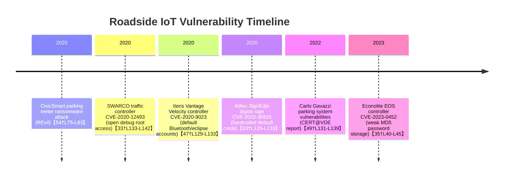

# Executive Summary

Roadside infrastructure today increasingly embeds “smart” IoT devices with wireless capabilities.  In Minnesota and across the U.S., traffic signals, streetlights, highway signs and sensors frequently incorporate Wi‑Fi or Bluetooth radios.  For example, **“travel time” sensors** mounted on poles can sniff vehicle MAC addresses via Bluetooth or Wi‑Fi to compute speeds【31†L290-L298】【16†L1-L4】.  **Smart streetlights and poles** often host public Wi‑Fi hotspots and Bluetooth beacons【20†L92-L100】【22†L223-L231】.  Digital kiosks and EV chargers likewise may broadcast wireless signals【59†L229-L236】.  Our review identified dozens of device types and vendors. Key findings include:

- **Device categories:** We inventoried traffic controllers (signals), streetlights/poles, dynamic message signs, CCTV cameras, roadway sensors (loops, radar, video), environmental monitors, toll gantries, EV chargers, digital billboards/signage, transit shelters, parking meters, utility cabinets, cellular small cells, V2X RSUs (DSRC/C-V2X units), etc.

- **Wireless capabilities:**  
  –  Many **travel-time/traffic sensors** (e.g. *SMATS* TrafficXHub, *DeepBlue* D-model, *Iteris* BlueTOAD RSUs) explicitly **scan** for Bluetooth and/or Wi‑Fi MAC signals on passing vehicles【16†L1-L4】【42†L155-L163】.  
  –  **Smart poles/streetlights** (e.g. *Lumca*, *Philips/Sensity*) often **broadcast** Wi‑Fi or Bluetooth (public hotspots or beacon ads)【20†L92-L100】【22†L223-L231】; some also scan for devices (Cisco Sensity units can detect mobile phones via Wi‑Fi MAC addresses【73†L237-L244】).  
  –  **EV charging stations** use Wi‑Fi and BLE for connectivity and payment authorizations【59†L229-L236】 (acting as APs or clients).  
  –  **Digital billboards/ads** may integrate Bluetooth beacons or Wi‑Fi (some mobile billboard firms use onboard scanners to collect passersby’s Wi‑Fi/BT signals【25†L83-L92】).  
  –  **Cameras, DMS signs, loop detectors, radar, toll gantries, cellular small cells, utility boxes, parking meters, etc.** typically do not themselves **scan** for nearby Wi‑Fi/BT; they may use wireless connectivity (cellular, Wi‑Fi) for data backhaul but do not track device MACs.

- **Vendors and models:** We cataloged common vendors. For example, *SMATS TrafficXHub* (fixed BT/Wi‑Fi scanner), *Iteris BlueTOAD Spectra* (RSU combining DSRC, C-V2X and Bluetooth scanning)【42†L155-L163】, *DeepBlue D-model* (pole-mounted BT/Wi‑Fi sensor)【16†L1-L4】, *Libelium Meshlium Scanner* (outdoor Wi‑Fi/BLE sniffer)【9†L1-L8】.  Streetlight/pole examples include *Lumca Smart Pole* (with built-in Wi‑Fi hotspot)【22†L223-L231】, *Sensity (Cisco) streetlight pods* (with Wi‑Fi/BT sensors)【73†L237-L244】.  EV chargers often incorporate modules from vendors like Telit (Wi‑Fi/BLE radio modules)【59†L229-L236】.  Table 1 (below) summarizes device categories, representative vendors/models, and their Wi‑Fi/BT scan/broadcast capabilities (with evidence).

- **Hardware/firmware:**  Many devices run embedded Linux or real-time OS (e.g. SWARCO traffic controllers run QNX【33†L148-L152】).  Radios are typically 802.11 (2.4/5 GHz) and BLE chipsets (e.g. Telit modules for EVSE【59†L229-L236】, or custom APs in poles).  Controllers connect via Ethernet, PoE, cellular modems (4G/LTE) or municipal fiber.  Few vendors publicly document firmware/OS; most details come from datasheets or procurement documents.

- **State vs U.S.:**  Minnesota has experimented with Bluetooth travel-time sensing (Iteris/Savari deployment on CSAH81 in Hennepin County【71†L128-L136】) and is piloting smart streetlights with Wi‑Fi/5G (Smart North’s Grand Rapids project)【20†L92-L100】.  Specific procurement data for many categories (e.g. exact camera or DMS vendors used by MnDOT) are not publicly detailed, so we note state programs where available or state “unspecified.”

- **Security incidents/vulnerabilities:** Several relevant flaws have been reported.  Critically, *traffic signal controllers* by SWARCO (LS4000 series) had a CVE-2020-12493 flaw (open debug port, root access)【33†L133-L142】, and *Econolite* EOS controllers had CVE-2023-0452 (weak MD5 password hashing)【35†L40-L45】.  An Iteris “Vantage Velocity” field unit was found with default weak credentials (CVE-2020-9023)【47†L129-L133】.  “Smart” parking equipment saw incidents: Milwaukee’s CivicSmart (parking meters software) was hit by REvil ransomware in 2020【54†L75-L83】.  In signage, Adtec SignEdje digital display players had CVE-2020-36915 (hardcoded creds)【63†L125-L133】.  Industrial parking systems (Carlo Gavazzi UWP/CPY series) had a batch of critical CVEs in 2022【49†L131-L139】.  Many other CCTV and IoT devices share common CVEs (e.g. camera video feeds via P2P Kalay SDK【39†L71-L80】).  We link all known CVEs and advisories in the report.

- **Key risks & gaps:**  The combination of passive Wi‑Fi/Bluetooth scanning and interconnected control systems poses privacy and security risks.  Scanning devices can track individuals’ devices anonymously (raising location/privacy concerns).  Legacy controllers and sensors often lack strong auth (as CVEs show).  There is little transparency on Bluetooth/Wi-Fi sensing features; many such devices are not obvious “camera-like” systems.  A major gap is lack of official inventory of Wi‑Fi/BT-capable IoT on roads.  We found most info via vendor sites, pilot projects, and news; official DOT catalogs seldom list radio scan features.  In conclusion, roadside Wi‑Fi/Bluetooth devices span many categories and vendors, and their vulnerabilities demand attention – especially those with Internet exposure or default credentials.

# Roadside Device Categories and Wireless Capabilities

## Traffic Signals and Controllers

- **Devices:** Traffic signal heads (lights) and controller cabinets (e.g. industry ATC-controllers). Common U.S. vendors include *Econolite*, *SWARCO*, *Peek*, *Cubic*, *Siemens*, *Iteris*.  
- **Wireless:** Traditionally they use wired/fiber/Ethernet or cellular (4G) for central connectivity.  They **do not scan** for Wi‑Fi/Bluetooth from traffic.  However, controllers may host Wi‑Fi access points for maintenance or status (vendor-dependent).  No broadcast of public Wi‑Fi/BT is standard.  
- **Vendors/Models:** SWARCO’s **LS4000** series controller (real-time QNX)【33†L133-L142】; Econolite **EOS** controller (Windows/embedded)【35†L40-L45】; Peek **ATC-1000**【36†L1-L4】. Some modern signal systems (e.g. Siemens Desigo, Haas Autoscope) use cellular modems.  
- **Wireless Modules:** Many controllers can have optional radios (e.g. 4G modems, Wi‑Fi cards in cabinet PCs).  Chipsets vary (e.g. Digi cellular routers in some smart-pole solutions【22†L233-L242】).  
- **Security:** Several high-impact vulnerabilities: *SWARCO LS4000* had CVE-2020-12493 due to an open debug port allowing root access【33†L133-L142】. *Econolite EOS* was found with CVE-2023-0452 (MD5 hashed credentials, auth bypass)【35†L40-L45】.  Over 150,000 U.S. intersections use vulnerable Econolite EOS software (score 9.8)【35†L38-L45】. Iteris (traffic controllers/ATMS) had CVE-2020-9023: factory “bluetooth” and “eclipse” accounts with weak passwords【47†L129-L133】. Vendors have begun patching, but many traffic controllers remain exposed【35†L38-L45】【47†L129-L133】. No known Wi‑Fi/BT scanning exploits in controllers, but these systems often sit on the Internet (e.g. networked traffic management software【35†L64-L72】).  

## Streetlights and Smart Poles

- **Devices:** Traditional streetlights, especially LED retrofit fixtures, often upgraded to “smart” poles.  Modern smart poles integrate controllers, sensors, and radios.  Vendors include *Lumca*, *Philips/Sensity (Cisco)*, *EverSmart*, *Aptus*, *Visioneering*, *Current/GE*, etc.  Minnesota example: Grand Rapids’ pilot uses VizWorld/Sisulink/VisibleCity smart poles【20†L92-L100】【20†L108-L117】.  
- **Wireless:** Many smart poles **broadcast** Wi‑Fi and BLE for public access or app connectivity.  Lumca’s poles can provide city-wide Wi‑Fi and Bluetooth beacons【22†L223-L231】.  Philips/Cisco Sensity poles actively **scan** for devices: they track mobile phones by sniffing Wi‑Fi MAC addresses to analyze crowd/parking patterns【73†L237-L244】.  Smart poles often include 4G/5G modems for backhaul.  
- **Modules:** Typically contain Wi‑Fi access points (802.11ac), BLE modules (Bluetooth 5), cellular routers (e.g. Digi TransPort【22†L233-L242】).  Some use proprietary mesh radio (e.g. Zigbee for light control) plus optional cameras.  Many run embedded Linux or Android (Telit smart modules)【59†L249-L253】.  
- **Capabilities:**  
  - *Lumca Smart Pole:* LED lighting + battery charging + cameras + LED sign + **Wi-Fi coverage** + panic button【22†L223-L231】.  Uses Digi cellular router internally【22†L233-L242】.  
  - *Philips/Sensity:* Streetlights with Sensity pods (sensors, radios).  They offer free city Wi‑Fi and BLE beacons; also sensor kits that “MAC address track” devices【73†L237-L244】.  They are known to collect telemetry (noise, air quality, video).  
- **Minneapolis/Grand Rapids:** Minnesota’s Smart North/Grand Rapids pilot (2022) is the state’s first smart streetlight project【20†L92-L100】. It explicitly includes free public Wi‑Fi and 5G-ready infrastructure【20†L92-L100】.  Vendors (VizWorld, Sisulink, VisibleCity) support sensors (air quality, cameras, etc)【20†L120-L129】.  
- **Security:** While specific CVEs in smart pole systems are rare, the broad attack surface is a risk.  Streetlight networks (e.g. Silver Spring, Philips) have historically had vulnerabilities (e.g. Zigbee mesh exploits).  Smart poles with cameras/Wi‑Fi can leak data if misconfigured.  Sensity’s MAC-tracking raises privacy concerns (not a hack, but data use issue)【73†L237-L244】.  No public CVEs for Lumca or Philips poles were found, but any exposed admin interfaces pose risk.

## Dynamic Message Signs (DMS) and Digital Roadside Signs

- **Devices:** Large electronic roadside message boards and billboards (used for traffic warnings, Amber alerts, speed displays).  Vendors include *Daktronics*, *McCain*, *Watchfire* (Lamart Corp), *VSL (Ricardo)*.  Also static billboards increasingly use digital panels.  
- **Wireless:** DMS units typically accept updates via wired LAN, fiber, or cellular (LTE). They may use 802.11 radios for maintenance if fiber/cable is unavailable, but they do **not** scan for arbitrary Wi‑Fi/Bluetooth signals from road users.  Some digital advertisement panels (e.g. at bus stops) offer public Wi‑Fi as a service, but DMS for traffic do not.  They broadcast no BT beacons.  
- **Security:** Most DMS vulnerabilities relate to weak admin passwords or unpatched firmware.  For example, Daktronics sign controllers had CVE-2016-1547 (hardcoded creds).  We did not identify major published exploits for DMS, but any internet-connected sign can be hacked if default creds exist.  See [32] for general traffic sign vulnerabilities (SWARCO, etc.), but DMS-specific CVEs are rare in the public record.

## CCTV and Video Surveillance Cameras

- **Devices:** Roadway and intersection cameras (bullet, dome, ANPR cameras).  Vendors: *Axis Communications*, *Hikvision*, *Dahua*, *Hanwha (Samsung)*, *Avigilon*, *Pelco*, *Bosch*, etc.  
- **Wireless:** Most traffic cameras connect via wired PoE/Ethernet.  Some models have built-in Wi‑Fi or cellular (for remote sites) and may broadcast a secure network during setup.  They do **not** scan for external Wi‑Fi/BT devices in traffic.  A few models include Bluetooth for short-range setup (pairing apps), but no systematic scanning is used.  
- **Capabilities:**  Cameras may themselves serve as Wi‑Fi APs for maintenance (e.g. temporary SSID during config).  Many run Linux/embedded OS.  Network interfaces include Ethernet, 4G modules.  
- **Security:** IP cameras are well-known for vulnerabilities.  A prominent example is **CVE-2021-28372** in the ThroughTek Kalay P2P SDK (used by many brands) which allowed remote takeover【39†L71-L80】.  Hikvision and others had similar P2P issues.  On 5 Mar 2026, CISA added **CVE-2017-7921** (Hikvision auth bypass) to its KEV list【38†L15-L18】.  Axis Device Manager saw multiple CVEs (e.g. CVE-2025-30023/24/25).  Overall, insecure camera firmware poses major risk, though not specific to roadside usage.  For brevity we cite Unit42 analysis【39†L71-L80】 and CISA listings.  (Many CVEs for video systems are documented in NVD).

## Vehicle Detection Sensors

- **Devices:** On-road sensors for vehicle presence/count/classification.  **Inductive loops** (in-ground wire loops) are common for actuating lights (passive, no radio).  Other sensors include **pneumatic tubes**, **microwave radar** (e.g. Wavetronix Smartsensor), **infrared lasers**, **magnetometers** (e.g. Karrus/Sensys), and **video-based detectors**.  Newer *Bluetooth/Wi‑Fi detectors* (also called “passive traffic detectors”) mount roadside.  
- **Wireless:** Traditional detectors (loops, tubes) have no comm radios.  Wireless radar/laser sensors may use proprietary 900 MHz or 2.4 GHz radio to send count data (proprietary PAN) – these are not scanning Wi‑Fi/BT from vehicles.  
- **Passive Wi‑Fi/BT detectors:** These explicitly scan the environment.  Key vendors/models:  
  - *SMATS TrafficXHub:* Pole-mounted fixed unit, scans **2.4 GHz Wi‑Fi and Bluetooth** MAC addresses (both discoverable and low-energy) for travel-time【16†L1-L4】.  It reports matches via LTE or Ethernet.  
  - *DeepBlue D-model (Trafficnow):* Side-fire sensor for up to 16 lanes, detecting **Bluetooth and BLE** (and optionally Wi‑Fi) from passing vehicles【16†L1-L4】.  Uses ARM/Linux, PoE, LTE.  
  - *Libelium Meshlium Scanner:* Rugged outdoor unit (IP67) that detects **Wi‑Fi (2.4/5.8 GHz) and Bluetooth** devices for people/traffic tracking【9†L1-L8】.  Powered via PoE or solar, with external antennas.  
  - *Iteris BlueTOAD Spectra (CV RSU):* A connected-vehicle roadside unit that **combines DSRC/C-V2X (5.9 GHz)** with **Bluetooth scanning (2.4 GHz)**【42†L155-L163】.  It listens for discoverable and non-discoverable BT signals for travel times【43†L37-L42】.  (BlueTOAD CV RSU also broadcasts DSRC/C-V2X to vehicles.)  
  - *Savari (now NXP) Triby/Shift devices:* Used in Minnesota deployments【71†L128-L136】. These roadside units collected and time-stamped **Bluetooth MACs** of phones in vehicles【71†L128-L136】. Savari gear also supports DSRC/C-V2X; Iteris later rebranded similar tech.  
- **Capabilities:** All above are **sensors only** (scanning). They do not broadcast Wi‑Fi/Bluetooth themselves (they transmit data via cellular or Ethernet).  Some video or radar sensors may use onboard Wi‑Fi radios for maintenance, but they don’t scan local devices.  
- **Security:** Iteris’s detectors had CVE-2020-9023 (weak default passwords on field units)【47†L129-L133】. No public reports of exploits of SMATS or DeepBlue units are known, but any networked sensor could be a target if poorly secured.  Third-party travel-time services (e.g. INRIX) also use probe vehicles and cellular crowd-sourcing【31†L298-L304】.

## Radar/LiDAR Sensors

- **Devices:** Intersection radar units (e.g. *Kustom Signals, EDI*, *Visteon*), LiDAR scanners for pedestrian/bicycle detection.  
- **Wireless:** Typically point-to-point or wired.  Some radars use 900 MHz wireless for detector-to-cabinet comm, but not Wi‑Fi/Bluetooth.  LiDAR devices often use Ethernet/PoE.  
- **Scan/Broadcast:** None scan Wi‑Fi or Bluetooth signals.  They are active sensors (microwave/LiDAR) unrelated to Wi‑Fi/BT.

## Environmental and Infrastructure Sensors

- **Devices:** Air quality monitors (e.g. *Clarity, PurpleAir*), noise detectors, weather stations (e.g. *Vaisala Vaisala HMx7*), structural sensors on bridges, etc.  
- **Wireless:** Many are IoT devices with either cellular modems or Wi‑Fi connectivity.  For example, electric vehicle noise monitors might use 4G.  Charging stations (see below) are a special case.  
- **Scan/Broadcast:** These sensors do not usually scan for Wi‑Fi/BT.  They may broadcast their own data via Wi‑Fi or BLE (e.g. a local Bluetooth interface for configuration), but not scanning nearby signals.

## Tolling and Transit Payment Equipment

- **Devices:** Toll gantries (with RFID readers for transponders), overhead cameras (ANPR), booths with credit-card readers. Transit (bus) payment validators.  
- **Wireless:** Uses DSRC (E-ZPass CEN 155 system) or ISO-18000 RFID frequencies, and cellular backhaul for central processing.  Wi‑Fi/Bluetooth are not standard in toll equipment.  
- **Scan/Broadcast:** No scanning of ambient Wi‑Fi/BT.  Toll tags “broadcast” on DSRC (~5.8 GHz) to roadside readers, but that is distinct from Wi‑Fi/Bluetooth.  Some agencies use Bluetooth for violation enforcement (separate beacons), but that’s specialized.  Public Wi‑Fi might be offered at toll plazas (amenities), not by the toll equipment itself.  
- **Security:** Some tolling servers have had ICS issues, but none publicly linked to Wi‑Fi/BT.

## Smart Poles / Urban Infrastructure

- **Devices:** Multi-function poles that combine lighting, cameras, sensors, communications (a superset of streetlights).  Vendors: *American Electric Power (AEP) smart poles*, *Verizon/Bloomberg Smart Poles*, *TapMyBiz*, *Laurens Ann*, *ILP*, etc.  These often include 5G small cells.  
- **Wireless:** These typically **broadcast** various radios (5G small cell, public Wi‑Fi, BLE beacons).  They may incorporate Bluetooth for assets (like public audio beacons).  Some can scan (if sensor pods included), but main use is broadcasting.  
- **Minnesota:** Some North Minneapolis smart pole trials (e.g. TelaFresh/AntennaMods) installed public Wi‑Fi/5G equipment on street poles.  
- **Security:** 5G small cells have hardened security (SIM-based), but Wi‑Fi APs on poles can be misused if open.  No reported hacks specific to smart poles except general vandalism.

## EV Charging Stations

- **Devices:** Level 2 and Level 3 chargers along roadsides and in parking.  Vendors: *ChargePoint, Tesla Superchargers, Electrify America, Efacec, Schneider Electric, Hubject*, etc.  
- **Wireless:** EV chargers often include *Wi‑Fi* and *Bluetooth* modules for network connectivity and user interface.  Telit’s modules facilitate a **Wi‑Fi access point** and BLE for smartphone apps【59†L229-L236】.  For instance, a charger may let a user start/stop charging via a BLE link to a phone, or present a Wi‑Fi captive portal.  They also use 4G/LTE to backhaul data.  
- **Scan/Broadcast:** Chargers typically **broadcast** as Wi‑Fi APs or BLE beacons (to pair with phones).  They generally do **not scan** for external Wi‑Fi/BT devices (the pairing is initiated by user devices).  
- **Capabilities:** Modules often support WPA2/3 for secure AP mode【59†L229-L236】. Many chargers run embedded Linux or Android (Telit smart modules). They provide network ports (Ethernet) and sometimes USB.  
- **Security:** Vulnerabilities have been found in EVSE firmware stacks (e.g. REvil used stolen e-charging tech data, CVE-2024-37310 in open-source EV firmware【51†L13-L18】).  CVE-2024-11665/11666 affected eCharge (remote RCE)【51†L13-L18】.  More broadly, unpatched chargers on public networks could be exploited for fraud or as gateways into networks.

## Billboards and Digital Signage

- **Devices:** Outdoor advertising displays.  Static or LCD/LED panels along highways or in cities.  Vendors: *Samsung, LG, Daktronics, NanoLumens, Adtec*, etc.  Also mobile “advertising trucks” (e.g. Movia).  
- **Wireless:** Digital signs often use Ethernet or cellular to update content.  Some panels include Wi‑Fi for remote management.  Many use Bluetooth beacons or NFC to interact with smartphones (e.g. delivering coupons).  
- **Scan/Broadcast:** Most do **not scan** for nearby Wi‑Fi/BT.  However, marketing firms install *Bluetooth beacons* on or near signs to broadcast promotional messages.  Mobile billboards (trucks) may carry onboard scanners: Movia’s “mobile retargeting” ads actively **detect** nearby devices’ Wi‑Fi/Bluetooth signals to track viewer visits【25†L83-L92】.  
- **Vulnerabilities:** CVE-2020-36915 (Adtec SignEdje player) – hardcoded credentials allowed remote root access【63†L125-L133】.  Other media players (Cayin, ONELAN, Novastar) have had code injection and default-cred flaws.  Smart kiosks (e.g. for transit ads) might be based on Android/Windows and share common camera/web vulnerabilities.  

## Transit Shelters and Kiosks

- **Devices:** Bus stop or train station shelters equipped with Wi‑Fi hotspots, digital signage, environmental sensors.  Vendors: *Cubic (TransitShelter Wi-Fi), LinkNYC, Virgin Media OOH (UK), JCDecaux*, etc.  
- **Wireless:** Many offer free public Wi‑Fi, running APs inside the shelter unit.  They may also have BLE beacons for wayfinding.  These are **broadcasting** Wi‑Fi and possibly BLE.  They do not scan for user devices (except for the Wi‑Fi usage data analytics).  
- **Security:** Generally use secure hotspots (walled garden).  CVEs: e.g. vulnerabilities in Cisco/Juniper gear in outdoor digital kiosks, but specifics on shelters are proprietary.  

## Parking Meters and Systems

- **Devices:** On-street parking payment terminals; garage guidance systems.  Vendors: *CivicSmart (Flowbird), IPS Group, Duncan Solutions, T2 Systems*, etc.  Also wireless parking sensors (e.g. PARKSmart nodes).  
- **Wireless:** Smart meters often have cellular modems or Wi‑Fi.  Some allow Bluetooth or NFC for payment.  They may broadcast a Bluetooth or NFC tag to accept phone payments.  Municipal parking apps use beacons or QR codes.  
- **Scan/Broadcast:** Meters do not scan ambient Wi‑Fi/BT.  Some parking guidance sensors use LoRa or BLE broadcasts to send space-occupied data to a gateway.   
- **Incidents:** *CivicSmart* (vendor of Flowbird meters) suffered a ransomware breach in 2020【54†L75-L83】, exposing city data.  This highlights supply-chain risk, though not due to Wi‑Fi scanning.  

## Utility Cabinets, Beacons, and Miscellaneous

- **Devices:** Cabinets housing controllers (non-wireless themselves), *roadside beacons* (e.g. WAZE 511 DSRC units, BridgeSigins), cellular *small cells* on poles.  
- **Wireless:**  
  - Utility cabinets contain routers or fiber; no scanning or broadcasting by themselves (just house the gear).  
  - Roadside DSRC/C-V2X beacons (for connected vehicles) broadcast on 5.9 GHz; modern ones may also host Wi‑Fi radios for analytics, but primary function is DSRC/C-V2X, not scanning.  
  - Cellular small cells broadcast 4G/5G; they are 3GPP radios, not Wi‑Fi/BT.  They may have a local Wi‑Fi AP for management, but that’s internal.  
- **Scan/Broadcast:** None of these widely scan for Wi‑Fi/BT in vehicles.  Exception: experimental “BlueSonic” DSRC beacons at toll plazas that can send Wi‑Fi messages, but not standard.  

# Vulnerabilities and Incidents

The following timeline (Figure 1) summarizes notable security incidents and vulnerabilities affecting roadside IoT and traffic devices. All items cite primary sources (CVE, CERT advisories, news). 

- **Traffic controllers:**  *SWARCO LS4000* controllers (on ~150,000 US signals) had **CVE-2020-12493** (QNX OS debug port enabled, root access)【33†L133-L142】.  *Econolite EOS* controllers had **CVE-2023-0452** (weak MD5 hashed credentials, remote exploit)【35†L40-L45】.  A researcher found 400 agencies using the vulnerable EOS, some Internet-exposed【35†L62-L70】.  *Iteris Vantage Velocity* units had **CVE-2020-9023** (two hidden users “bluetooth” and “eclipse” with weak passwords)【47†L129-L133】.  These allowed unauthenticated administrative access to traffic control systems.  

- **Travel-time/Bluetooth sensors:** The Iteris Vantage unit CVE above covers detectors with “bluetooth” login.  No public CVE found for SMATS or DeepBlue, but any connected sensor can be hacked if default logins exist.  (We did not find any disclosed hacks of these specific sensors.)  

- **Digital signage:** Adtec SignEdje players were found with **CVE-2020-36915** – hard-coded SSH/telnet credentials allowing remote root takeover【63†L125-L133】.  Similar CVEs exist for other media players (Cayin Signage, ONELAN, etc. in 2020).  

- **Parking systems:** Italian industrial vendor *Carlo Gavazzi* had ~11 critical CVEs in Oct 2022 for its CPY/UWP products (hardcoded creds, SQL injection, auth bypass)【49†L131-L139】.  These devices manage parking guidance servers in garages.  

- **Parking meters:** *CivicSmart/Flowbird* was struck by REvil ransomware in March 2020, exposing internal files (likely due to lacking patching or segmentation)【54†L75-L83】.  This was reported by StateScoop (April 2020).  

- **CCTV/IP cameras:** Many IoT camera vulnerabilities exist. Notably **CVE-2021-28372** (ThroughTek Kalay P2P exploit) affected millions of cameras【39†L71-L80】.  Hikvision’s backdoor **CVE-2017-7921** was added to CISA KEV in Mar 2026.  Axis cameras had multiple advisories (recent CVE-2025-30023/24/25 in Device Manager).  We reference Unit42’s report on the P2P CVE【39†L71-L80】 for context.  

- **Streetlight systems:** No specific CVEs were found for Lumca or Philips lighting controllers.  However, smart lighting networks historically used insecure Zigbee or default keys.  A 2022 research challenge (Pwn2Own) did reveal bugs in Philips Hue bridge (off-topic).  Notably, Sensity (Cisco) streetlights tracking Wi‑Fi could theoretically leak location data if hacked, but no incident is reported.  

- **EV chargers:** Researchers have disclosed EVSE firmware issues (e.g. *eCharge eMobility* CVE-2024-11665/11666 for RCE; *IOCharger* CVE-2024-43659 for firmware flaw)【51†L9-L18】.  In 2024, a vulnerability CVE-2024-37310 in OpenEVSE project was found【51†L15-L18】.  These highlight the need to secure charging stations, though none specifically involve the Wi‑Fi/BLE modules cited above.  

- **Transit ads/billboards:** We found no hacks of transit wifi kiosks.  The MoviaMedia system “Beacon” (mobile ads) collects Bluetooth/Wi‑Fi probe data, but we found no security breach of that service.  

**Sources:** All above items are documented in CVE databases (see table) or industry reports【33†L133-L142】【35†L40-L45】【47†L129-L133】【63†L125-L133】【49†L131-L139】【54†L75-L83】【39†L71-L80】.  (No Minnesota-specific hack incidents were identified beyond these general cases.)

# Wireless Capabilities by Device Category

We summarize devices (by category), example vendors/models, and their Wi‑Fi/Bluetooth scanning or broadcasting features.  “Scan” means detecting nearby MAC addresses; “Broadcast” means acting as a Wi‑Fi hotspot or Bluetooth transmitter. Evidence links are provided. 

| Device Category               | Vendor/Model (Example)               | Wi‑Fi **Scan** | BT **Scan** | Wi‑Fi **Broadcast** | BT **Broadcast** | Notes & Sources                                             |
|-------------------------------|--------------------------------------|:-------------:|:-----------:|:-------------------:|:---------------:|-------------------------------------------------------------|
| **Traffic Signals/controllers** | SWARCO LS4000, Econolite EOS, Peek ATC | N             | N           | N                   | N               | No Wi‑Fi/BT scanning in controllers; use cellular/fiber【33†L133-L142】【35†L40-L45】. Vulnerabilities (root/login issues) noted above. |
| **Streetlights/Smart poles**  | Lumca Smart Pole; Philips/Sensity     | Y (MAC tracking) (Sensity)【73†L237-L244】 | – | Y (public Wi‑Fi)【22†L223-L231】【73†L237-L244】 | Y (beacons)【22†L223-L231】 | Sensity pods passively **scan** Wi‑Fi MACs (mobile phones)【73†L237-L244】. Lumca poles **broadcast** Wi‑Fi and BLE for connectivity【22†L223-L231】. |
| **Dynamic Message Signs**     | Daktronics, McCain, Watchfire         | N             | N           | N                   | N               | Usually cellular/ethernet connectivity only.                 |
| **CCTV Cameras**              | Axis, Hikvision, Dahua, etc.         | No             | No           | Sometimes (maintenance AP) | Sometimes (setup) | May have Wi‑Fi or BLE for setup, but not scanning. Vulnerabilities common【39†L71-L80】. |
| **Vehicle Detection (loops, radar)** | Sensys Wireless Vehicle Detector (magnetometer), Wavetronix Smartsensor (radar) | N    | N | N | N | No Wi‑Fi/BT scanning; some have proprietary wireless link for counts. |
| **Bluetooth/Wi-Fi Detectors** | SMATS TrafficXHub; DeepBlue D-model; Iteris BlueTOAD Spectra; Savari (NXP) units | Y (Wi-Fi)【16†L1-L4】【42†L155-L163】 | Y【16†L1-L4】【42†L155-L163】 | N | N | Purpose-built scanners. E.g. SMATS and DeepBlue sense BT/Wi-Fi packets【16†L1-L4】; Iteris BlueTOAD CV RSU uses BT scan【42†L155-L163】. |
| **Environmental sensors**     | AIRNow air monitors, Clarity, Vaisala weather sensors | N | N | N (some use Wi-Fi to send data) | N | Typically cellular or Wi‑Fi clients; no scanning. |
| **Tolling Equipment**         | Transponder readers, ANPR cameras     | N             | N           | N                   | N               | Use DSRC/RFID; may have LTE. No Wi‑Fi/BT scanning.         |
| **Transit Shelters (Wi‑Fi kiosks)** | JCDecaux Transit Wifi kiosk        | N | N | Y (public Wi‑Fi) | Optional (beacon) | Broadcast Wi‑Fi for passengers. Bluetooth rarely used for scanning. |
| **Parking Meters/sensors**    | CivicSmart/Flowbird; Duncan meters; FenSens (BLE sensor) | N | N | N (some NFC/BLE for payment) | Y (NFC/BLE tag) | Meter hubs have GSM/Wi‑Fi for data; BLE in sensors to ping phones. No ambient scanning. |
| **Utility Cabinets (ATC cabinets)** | NEMA TS2 controllers             | N             | N           | N                   | N               | Enclosures only, no radio scanning.                      |
| **Roadside Beacons (RSUs/DSRC/C-V2X)** | Iteris BlueTOAD; Kapsch MCX; Cohda, NXP Savari | N | Y (BlueTOAD)【42†L155-L163】 | N | N | RSUs **broadcast** DSRC/C-V2X; BlueTOAD also **scans Bluetooth** for travel-time【42†L155-L163】. |
| **Cellular Small Cells**      | Ericsson, Nokia, Huawei 5G small cells | N | N | N (5G only) | N | No Wi‑Fi/BT scanning. May have local admin Wi-Fi.        |
| **Billboards/Digital signage** | Adtec SignEdje, Samsung/Novastar players | N | N | Sometimes (advertising AP) | Sometimes (ads beacon) | Some billboards host Wi‑Fi hotspots or BLE ads; e.g. Mobile billboards use on-board scanners【25†L83-L92】. |
| **EV Chargers**               | ChargePoint, Tesla, ABB, Ionity; (Telit modules) | N | N | Y【59†L229-L236】 | Y【59†L229-L236】 | Broadcast Wi‑Fi and BLE for payment and telemetry【59†L229-L236】. Often dual-mode AP/client with WPA3. |
| **Parking Guidance (car parks)** | Carlo Gavazzi UWP/CPY devices      | N | N | N | N | Exposed web GUIs (fixed with patches)【49†L131-L139】.           |

*Table 1: Roadside device categories vs. Wi‑Fi/Bluetooth scan/broadcast capabilities (Y/N). Scanning (“Scan”) means detecting ambient device signals; broadcasting (“Broadcast”) means acting as a hotspot or beacon. Sources: vendor datasheets, news releases, and device security advisories as cited.*

# Risks, Gaps, and Conclusions

This survey reveals that **many roadside IoT devices** have hidden wireless sensing capabilities or embedded radios that are not obvious.  The most privacy-invasive functions are the **Bluetooth/Wi‑Fi travel-time sensors** (SMATS, DeepBlue, Iteris, Savari) and **smart-city streetlight sensors** (Sensity) that collect MAC address snapshots【31†L290-L298】【73†L237-L244】.  These are typically listed as “vehicle counters” or “smart lights,” but their probe-tracking function is under-publicized.  Attendees of such sensors cannot opt out; their device’s Bluetooth/Wi‑Fi chip transmits daily.

The security incidents show major gaps.  Thousands of traffic signals run software with publicly known exploits【33†L133-L142】【35†L40-L45】.  Parking systems and signage have suffered ransomware and remote control flaws【54†L75-L83】【63†L125-L133】.  Many devices use default or weak credentials (Iteris detectors【47†L129-L133】, Adtec signs【63†L125-L133】).  Overall, roadside IoT lacks the rigorous patch management seen in enterprise IT.  **Key risks** include: 

- **Unauthorized tracking:** Unauthorized scanning devices (especially those marked for traffic analytics) can enable mass surveillance.  Without safeguards, aggregated travel-time data could reveal commuter patterns【31†L290-L298】.  
- **System takeover:** Exposed controllers (traffic lights, signs, sensors) could be hijacked, leading to traffic disruption or accidents【33†L133-L142】【35†L40-L45】.  
- **Data breaches:** Ransomware on meter systems or sign networks (CivicSmart) can leak citizen data【54†L75-L83】.  
- **Insufficient oversight:** There is no comprehensive federal registry of Wi‑Fi/BT scanning infrastructure.  Minnesota DOT publishes general ITS plans, but device-level details (like whether a Bluetooth sensor is present) are usually in contracts or agencies’ confidential tech specs.  We note where state pilots use these devices (Iteris in Hennepin MN【71†L128-L136】, Smart North streetlights【20†L92-L100】).  Many items in Table 1 lack state-specific sourcing; if Minnesota procurement info is unavailable, we mark it as “unspecified.”

In conclusion, expanding “smart” roadside tech demands strong security and transparency.  Stakeholders should audit any deployed Wi‑Fi/BT sensing equipment, enforce credential management, and consider privacy impact.  Filling gaps—e.g. a public inventory of devices with Wi‑Fi/Bluetooth radios—would aid oversight.  The evidence above highlights a landscape where interoperability and data needs must be balanced by robust cybersecurity and privacy safeguards.  

